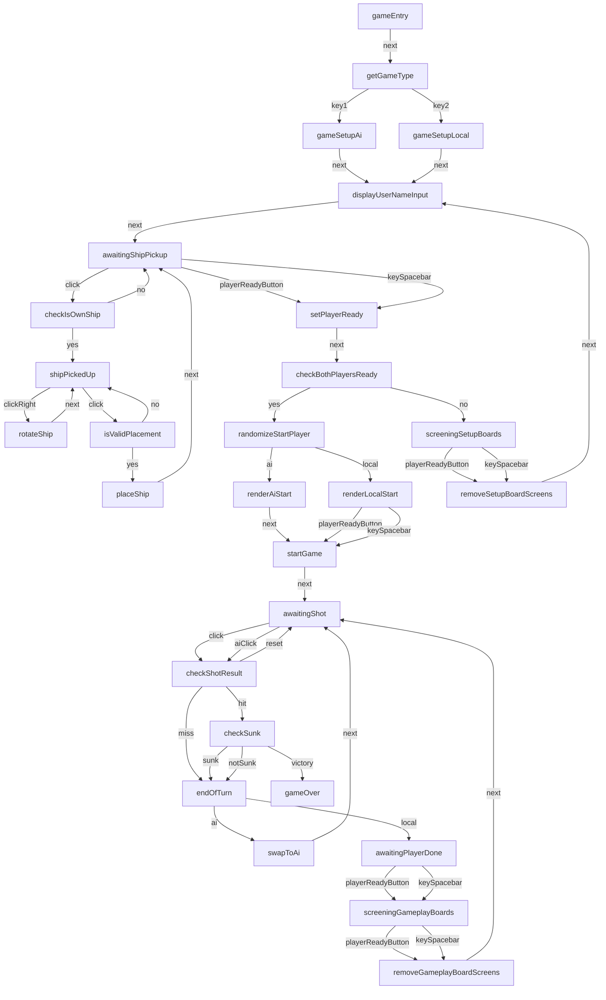

# Battleship
## State Transition Map

```mermaid
graph TD;
gameEntry[gameEntry] -- next --> getGameType[getGameType] ;
getGameType[getGameType] -- key1 --> gameSetupAi[gameSetupAi] ;
getGameType[getGameType] -- key2 --> gameSetupLocal[gameSetupLocal] ;
gameSetupAi[gameSetupAi] -- next --> displayUserNameInput[displayUserNameInput] ;
gameSetupLocal[gameSetupLocal] -- next --> displayUserNameInput[displayUserNameInput] ;
displayUserNameInput[displayUserNameInput] -- next --> awaitingShipPickup[awaitingShipPickup] ;
awaitingShipPickup[awaitingShipPickup] -- click --> checkIsOwnShip[checkIsOwnShip] ;
awaitingShipPickup[awaitingShipPickup] -- playerReadyButton --> setPlayerReady[setPlayerReady] ;
awaitingShipPickup[awaitingShipPickup] -- keySpacebar --> setPlayerReady[setPlayerReady] ;
checkIsOwnShip[checkIsOwnShip] -- yes --> shipPickedUp[shipPickedUp] ;
checkIsOwnShip[checkIsOwnShip] -- no --> awaitingShipPickup[awaitingShipPickup] ;
shipPickedUp[shipPickedUp] -- clickRight --> rotateShip[rotateShip] ;
shipPickedUp[shipPickedUp] -- click --> isValidPlacement[isValidPlacement] ;
rotateShip[rotateShip] -- next --> shipPickedUp[shipPickedUp] ;
isValidPlacement[isValidPlacement] -- yes --> placeShip[placeShip] ;
isValidPlacement[isValidPlacement] -- no --> shipPickedUp[shipPickedUp] ;
placeShip[placeShip] -- next --> awaitingShipPickup[awaitingShipPickup] ;
setPlayerReady[setPlayerReady] -- next --> checkBothPlayersReady[checkBothPlayersReady] ;
checkBothPlayersReady[checkBothPlayersReady] -- yes --> randomizeStartPlayer[randomizeStartPlayer] ;
checkBothPlayersReady[checkBothPlayersReady] -- no --> screeningSetupBoards[screeningSetupBoards] ;
randomizeStartPlayer[randomizeStartPlayer] -- ai --> renderAiStart[renderAiStart] ;
randomizeStartPlayer[randomizeStartPlayer] -- local --> renderLocalStart[renderLocalStart] ;
renderAiStart[renderAiStart] -- next --> startGame[startGame] ;
renderLocalStart[renderLocalStart] -- playerReadyButton --> startGame[startGame] ;
renderLocalStart[renderLocalStart] -- keySpacebar --> startGame[startGame] ;
startGame[startGame] -- next --> awaitingShot[awaitingShot] ;
screeningSetupBoards[screeningSetupBoards] -- playerReadyButton --> removeSetupBoardScreens[removeSetupBoardScreens] ;
screeningSetupBoards[screeningSetupBoards] -- keySpacebar --> removeSetupBoardScreens[removeSetupBoardScreens] ;
removeSetupBoardScreens[removeSetupBoardScreens] -- next --> displayUserNameInput[displayUserNameInput] ;
awaitingShot[awaitingShot] -- click --> checkShotResult[checkShotResult] ;
awaitingShot[awaitingShot] -- aiClick --> checkShotResult[checkShotResult] ;
checkShotResult[checkShotResult] -- reset --> awaitingShot[awaitingShot] ;
checkShotResult[checkShotResult] -- miss --> endOfTurn[endOfTurn] ;
checkShotResult[checkShotResult] -- hit --> checkSunk[checkSunk] ;
checkSunk[checkSunk] -- victory --> gameOver[gameOver] ;
checkSunk[checkSunk] -- sunk --> endOfTurn[endOfTurn] ;
checkSunk[checkSunk] -- notSunk --> endOfTurn[endOfTurn] ;
endOfTurn[endOfTurn] -- ai --> swapToAi[swapToAi] ;
endOfTurn[endOfTurn] -- local --> awaitingPlayerDone[awaitingPlayerDone] ;
swapToAi[swapToAi] -- next --> awaitingShot[awaitingShot] ;
awaitingPlayerDone[awaitingPlayerDone] -- playerReadyButton --> screeningGameplayBoards[screeningGameplayBoards] ;
awaitingPlayerDone[awaitingPlayerDone] -- keySpacebar --> screeningGameplayBoards[screeningGameplayBoards] ;
screeningGameplayBoards[screeningGameplayBoards] -- playerReadyButton --> removeGameplayBoardScreens[removeGameplayBoardScreens] ;
screeningGameplayBoards[screeningGameplayBoards] -- keySpacebar --> removeGameplayBoardScreens[removeGameplayBoardScreens] ;
removeGameplayBoardScreens[removeGameplayBoardScreens] -- next --> awaitingShot[awaitingShot] ;
```